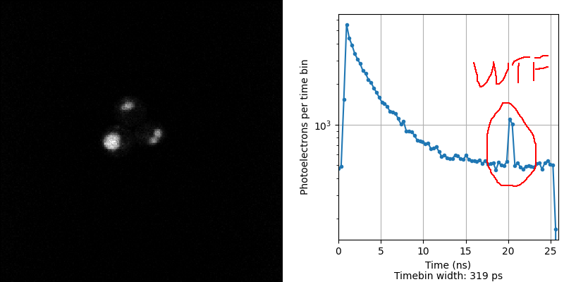
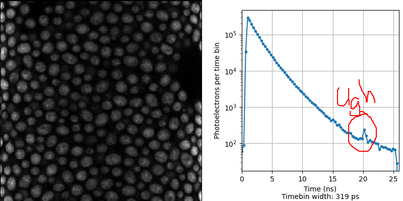
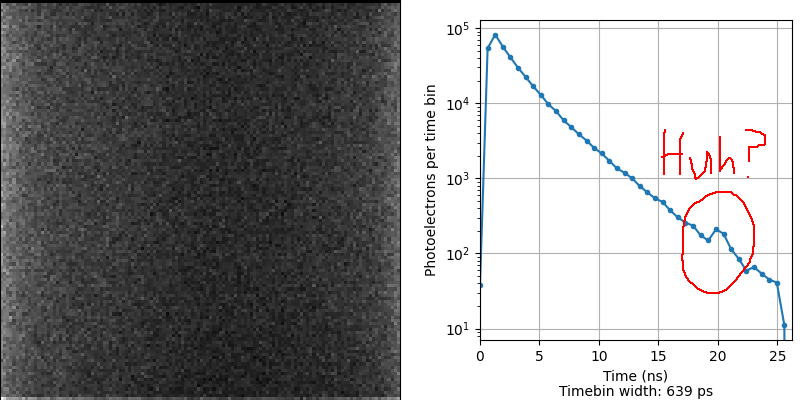

[Join the discussion via Twitter](https://twitter.com/AndrewGYork/status/1367924231023984641)

Hey microscopy folks: can you help me track down an artifact?

Our Leica SP8 with a PicoQuant lifetime system gives a spike in the lifetime histogram at 20 ns. Anybody know why?

The relative magnitude of the signal is smaller when the sample gives more signal.

Anybody else seeing this?

Here it is again in a dye solution, with a different timebinning.

Usually when I debug, I built the instrument, so I know where all the bodies are buried. I always feel a bit helpless trying to debug a commercial instrument.

This has to be simple, right? What am I missing?
